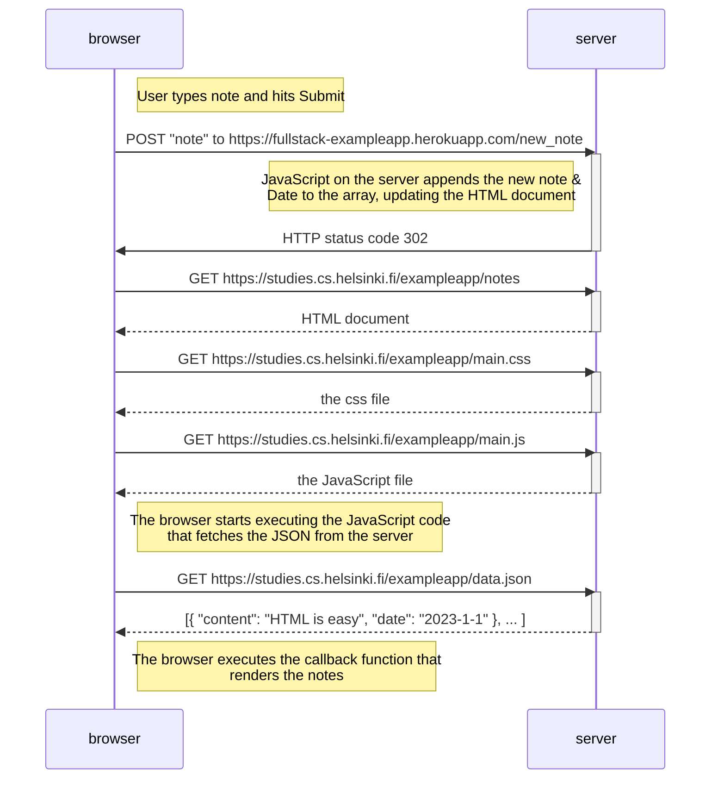

```mermaid
sequenceDiagram
    participant browser
    participant server

    Note right of browser: User types note and hits Submit
    browser->>server: POST "note" to https://fullstack-exampleapp.herokuapp.com/new_note
    activate server
    Note left of server: JavaScript on the server appends the new note & <br/>Date to the array, updating the HTML document
    server->>browser: HTTP status code 302
    deactivate server

    browser->>server: GET https://studies.cs.helsinki.fi/exampleapp/notes
    activate server
    server-->>browser: HTML document
    deactivate server

    browser->>server: GET https://studies.cs.helsinki.fi/exampleapp/main.css
    activate server
    server-->>browser: the css file
    deactivate server

    browser->>server: GET https://studies.cs.helsinki.fi/exampleapp/main.js
    activate server
    server-->>browser: the JavaScript file
    deactivate server

    Note right of browser: The browser starts executing the JavaScript code <br/> that fetches the JSON from the server

    browser->>server: GET https://studies.cs.helsinki.fi/exampleapp/data.json
    activate server
    server-->>browser: [{ "content": "HTML is easy", "date": "2023-1-1" }, ... ]
    deactivate server

    Note right of browser: The browser executes the callback function that <br/> renders the notes
```
