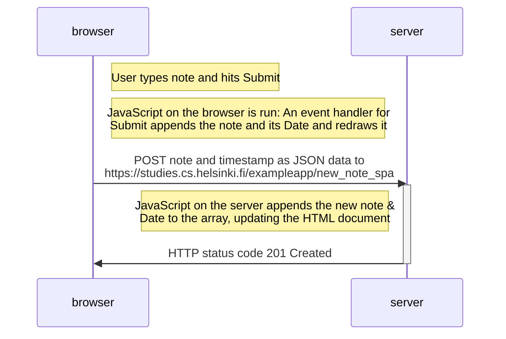

```mermaid
sequenceDiagram
    participant browser
    participant server

    Note right of browser: User types note and hits Submit
    Note right of browser: JavaScript on the browser is run: An event handler for  <br/> Submit appends the note and its Date and redraws it
    browser->>server: POST note and timestamp as JSON data to <br/> https://studies.cs.helsinki.fi/exampleapp/new_note_spa
    activate server
    Note left of server: JavaScript on the server appends the new note & <br/>Date to the array, updating the HTML document
    server->>browser: HTTP status code 201 Created
    deactivate server
```